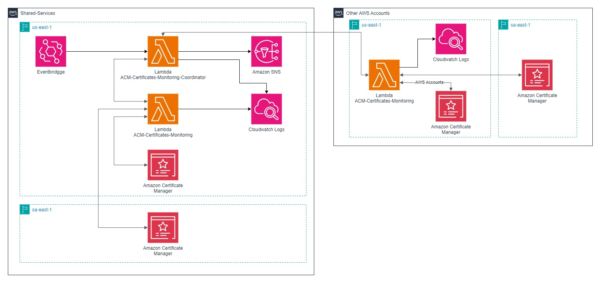

# ACM Certificates Monitoring Solution

This repository contains a solution for monitoring ACM (Amazon Certificate Manager) certificates across multiple AWS accounts. The solution is composed of two main components: **Coordinator** and **Worker**, each implemented as Lambda functions.

## Solution Overview

The solution consists of the following components:

- **Coordinator Lambda Function:** Deployed in a "shared services" AWS account, the Coordinator function triggers the Worker Lambda function(s) in one or more AWS accounts, including its own account. It collects the results from the Worker function and triggers an SNS topic to notify about ACM certificates close to expiration.
  
- **Worker Lambda Function:** This function checks the ACM certificates in the AWS account where it is deployed. It verifies the status of the certificates and sends the results back to the Coordinator function.

- **EventBridge:** Configured to periodically trigger the Coordinator function to check for certificates approaching their expiration.

- **SNS (Simple Notification Service):** Notifies the user when ACM certificates are close to expiration.

- **CloudWatch Logs:** Both the Coordinator and Worker functions log their operations for monitoring purposes.

### Architecture

Below is the architecture diagram showing how the components interact across multiple AWS accounts:

### Repository Structure

The repository contains two main branches:

- **Main Branch:** Contains only this `README.md` file, serving as an introduction and guide.
- **Coordinator Branch:** Contains the Terraform code to deploy both the Coordinator and Worker Lambda functions in the main AWS account (Shared Services).
- **Worker Branch:** Contains the Terraform code to deploy only the Worker Lambda function in additional AWS accounts.

## Usage

### Choosing the Right Branch

- If you are setting up the **Coordinator** function (and Worker in the same account), clone the **Coordinator Branch**.
- If you are setting up only the **Worker** function in another AWS account, clone the **Worker Branch**.

### Coordinator Branch Deployment

1. Clone the **Coordinator** branch.
2. Modify the `backend.tf` and `variables.tf` files as needed for your environment.
3. Run `terraform init` to initialize the project.
4. Run `terraform apply` to deploy the Coordinator and Worker Lambda functions in the main AWS account.

### Worker Branch Deployment

1. Clone the **Worker** branch.
2. Modify the `backend.tf` and `variables.tf` files to match your environment.
3. Run `terraform init` to initialize the project.
4. Run `terraform apply` to deploy the Worker Lambda function in the AWS account.

---

# Solução de Monitoramento de Certificados ACM

Este repositório contém uma solução para monitoramento de certificados ACM (Amazon Certificate Manager) em várias contas AWS. A solução é composta por dois componentes principais: **Coordinator** e **Worker**, cada um implementado como funções Lambda.

## Visão Geral da Solução

A solução consiste nos seguintes componentes:

- **Função Lambda Coordinator:** Implantada em uma conta AWS de "serviços compartilhados", a função Coordinator aciona as funções Lambda Worker em uma ou mais contas AWS, incluindo sua própria conta. Ela coleta os resultados da função Worker e aciona um tópico SNS para notificar sobre certificados ACM que estão prestes a expirar.
  
- **Função Lambda Worker:** Esta função verifica os certificados ACM na conta AWS onde está implantada. Ela verifica o status dos certificados e envia os resultados de volta para a função Coordinator.

- **EventBridge:** Configurado para acionar periodicamente a função Coordinator para verificar os certificados que estão próximos de expirar.

- **SNS (Simple Notification Service):** Notifica o usuário quando os certificados ACM estão próximos da expiração.

- **CloudWatch Logs:** Tanto as funções Coordinator quanto Worker registram suas operações para fins de monitoramento.

### Arquitetura

Abaixo está o diagrama de arquitetura mostrando como os componentes interagem em várias contas AWS:

### Estrutura do Repositório

O repositório contém duas branches principais:

- **Branch Main:** Contém apenas este arquivo `README.md`, que serve como introdução e guia.
- **Branch Coordinator:** Contém o código Terraform para implantar as funções Lambda Coordinator e Worker na conta AWS principal (Serviços Compartilhados).
- **Branch Worker:** Contém o código Terraform para implantar apenas a função Lambda Worker em contas AWS adicionais.

## Uso

### Escolhendo a Branch Certa

- Se você estiver configurando a função **Coordinator** (e Worker na mesma conta), clone a **Branch Coordinator**.
- Se você estiver configurando apenas a função **Worker** em outra conta AWS, clone a **Branch Worker**.

### Implantação da Branch Coordinator

1. Clone a **Branch Coordinator**.
2. Modifique os arquivos `backend.tf` e `variables.tf` conforme necessário para seu ambiente.
3. Execute `terraform init` para inicializar o projeto.
4. Execute `terraform apply` para implantar as funções Lambda Coordinator e Worker na conta AWS principal.

### Implantação da Branch Worker

1. Clone a **Branch Worker**.
2. Modifique os arquivos `backend.tf` e `variables.tf` para seu ambiente.
3. Execute `terraform init` para inicializar o projeto.
4. Execute `terraform apply` para implantar a função Lambda Worker na conta AWS.